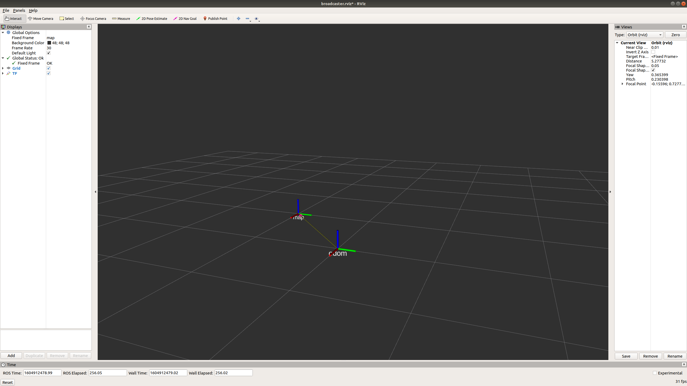

# ROS tf

This repository is a simple demonstration of tf(2) usage in ROS 1.

## Content

- [Publish Statis Transform](#Publish-Statis-Transform)
- [TF2 Broadcaster](#TF2-Broadcaster)
- [TF2 Listener](#TF2-Listener)
- [Errors](#Error)

## Publish Statis Transform

**TF2 (Recommended)**  
```xml
<launch>
    <node pkg="tf2_ros" type="static_transform_publisher" name="parent_frame_to_child_frame" args="1 0 0 0 0 0 parent_frame child_frame" />
</launch>
```
Explanation: `static_transform_publisher x y z yaw pitch roll parent_frame child_frame`

**TF1**  
```xml
<launch>
   <node pkg="tf" type="static_transform_publisher" name="parent_frame_to_child_frame" args="1 0 0 0 0 0 parent_frame child_frame 100" />
</launch>
```
Explanation: `static_transform_publisher x y z yaw pitch roll parent_frame child_frame publish_hz`

## TF2 Broadcaster

Details of writing a tf2 broadcaster display in the ROS node broadcaster_node. Look at `broadcaster.launch` for details. Use `rostopic pub /broadcaster_node/reset std_msgs/Bool "data: true"` command to trigger the broadcaster to broadcast. Note that to view the changes, you may want to have the static tf there.  

 

```bash
# Terminal 1
rostopic pub /broadcaster_node/reset std_msgs/Bool "data: true" -1
# Terminal 2
[ INFO] [1604912263.076903512]: callback!
[ INFO] [1604912263.276888023]: Processing!
```

## TF2 Listener

tf2 listener demonstrates how the node is able to listen to the changes between fixed_frame and odom_frame. You may use the broadcaster node to change the odom_frame position and request the listener node to display the position information through a rostopic as shown below.  

```bash
# Terminal 1
rostopic pub /listener_node/display_transform std_msgs/Bool "data: true" -1
# Terminal 2
## Before broadcater node change the tf
[ INFO] [1604912229.161304400]: listener_node: position x, y, z (1, 0, 0) x, y, z, w (0, 0, 0, 1)
## After broadcater node change the tf
[ INFO] [1604912270.161046625]: listener_node: position x, y, z (1, 1, 0) x, y, z, w (0, 0, 0, 1)
```

## Error

There are some funny errors that has been encountered before while using TF1. Below are the recommended methods if you would like to listen to a TF (works for simulation and real world scenario).  
```cpp
tf::StampedTransform transform;
try{
    now = ros::Time(0); // This is very important
    listener.waitForTransform(base_frame, target_frame, ros::Time(0), ros::Duration(3.0));
    listener.lookupTransform(base_frame, target_frame, ros::Time(0), transform);
}
```
